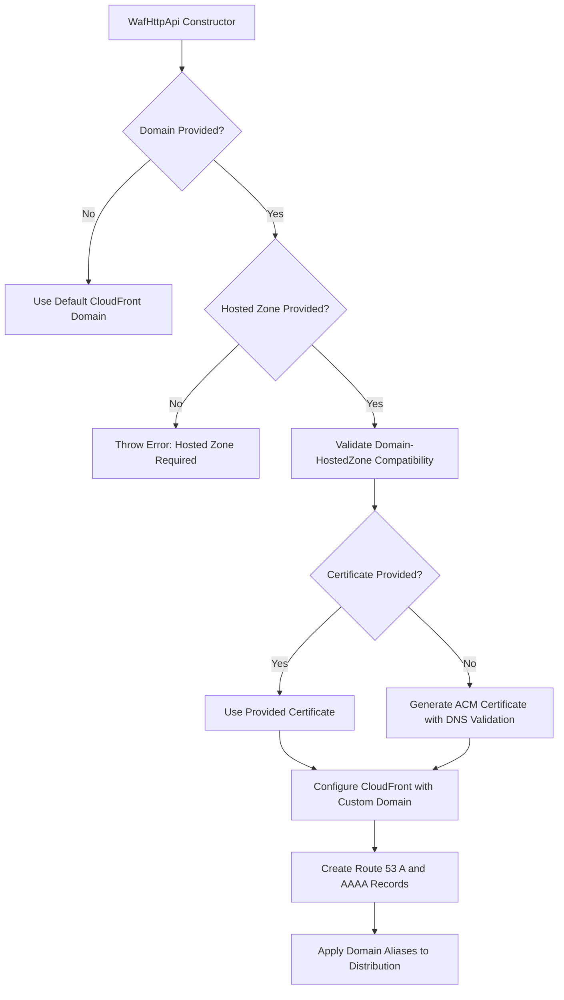

# Design Document

## Overview

This design extends the existing WafHttpApi construct to support custom domains and SSL certificates. The enhancement maintains backward compatibility while adding new optional properties for domain and certificate configuration. When a domain is specified without a certificate, the system will automatically generate an ACM certificate with DNS validation.

## Architecture

The enhanced WafHttpApi will integrate with AWS Certificate Manager (ACM) and modify the CloudFront distribution configuration to support custom domains. The architecture follows these key principles:

- **Backward Compatibility**: Existing usage patterns remain unchanged
- **Optional Enhancement**: Domain and certificate features are opt-in
- **Automatic Certificate Management**: Seamless certificate generation when needed
- **Regional Constraints**: ACM certificates for CloudFront must be in us-east-1

### Component Interaction Flow



## Components and Interfaces

### Enhanced WafHttpApiProps Interface

```typescript
export interface WafHttpApiProps {
  readonly httpApi: HttpApi;
  readonly wafRules?: wafv2.CfnWebACL.RuleProperty[];

  // New properties
  readonly domain?: string;
  readonly certificate?: acm.ICertificate;
  readonly hostedZone?: route53.IHostedZone;
}
```

### New Public Properties

The WafHttpApi class will expose these additional properties:

```typescript
export class WafHttpApi extends Construct {
  // Existing properties...
  public static readonly SECRET_HEADER_NAME = "X-Origin-Verify";
  public readonly distribution: cloudfront.Distribution;
  public readonly secretHeaderValue: string;

  // New properties
  public readonly certificate?: acm.ICertificate;
  public readonly customDomain?: string;
  public readonly aRecord?: route53.ARecord;
  public readonly aaaaRecord?: route53.AaaaRecord;
}
```

### Certificate Management Strategy

1. **User-Provided Certificate**: When both domain and certificate are provided, use the certificate directly
2. **Auto-Generated Certificate**: When only domain is provided, create a new ACM certificate
3. **No Custom Domain**: When no domain is provided, no certificate operations occur

### DNS Record Management Strategy

1. **Domain Requires Hosted Zone**: When domain is provided, hostedZone is mandatory and DNS records are automatically created
2. **Hosted Zone without Domain**: When hostedZone is provided without domain, ignore with warning
3. **Domain without Hosted Zone**: When domain is provided without hostedZone, throw descriptive error
4. **Domain Validation**: When hostedZone is provided, validate that domain matches or is subdomain of hosted zone
5. **Automatic DNS Records**: Route 53 A and AAAA records are automatically created for all custom domains

## Data Models

### Domain Validation

- Domain format validation using regex pattern for valid domain names
- Support for both apex domains (example.com) and subdomains (api.example.com)
- Wildcard domain support (\*.example.com)

### Certificate Validation

- Verify certificate exists and is valid
- Ensure certificate region is us-east-1 (CloudFront requirement)
- Validate that certificate covers the specified domain

### Hosted Zone Validation

- Verify hosted zone exists and is accessible
- Validate that domain matches or is a subdomain of the hosted zone's domain
- Support for both apex domains and subdomains within the hosted zone

## Error Handling

### Validation Errors

1. **Domain Without Hosted Zone**

   - Error: "Hosted zone required: Domain specified without hosted zone"
   - Thrown during construct initialization when domain is provided without hostedZone
   - Includes clear solution with code examples

2. **Invalid Domain Format**

   - Error: "Invalid domain format provided"
   - Thrown during construct initialization after hosted zone validation
   - Includes examples of valid domain formats

3. **Certificate Region Mismatch**

   - Error: "Certificate must be in us-east-1 region for CloudFront"
   - Thrown when provided certificate is in wrong region

4. **Certificate Domain Mismatch**

   - Error: "Certificate does not cover the specified domain"
   - Thrown when certificate doesn't match domain

5. **Certificate Without Domain**

   - Warning: "Certificate provided without domain, ignoring certificate"
   - Logged but doesn't throw error

6. **Hosted Zone Domain Mismatch**

   - Error: "Domain does not match or is not a subdomain of the hosted zone"
   - Thrown when domain doesn't belong to the provided hosted zone

7. **Hosted Zone Without Domain**
   - Warning: "Hosted zone provided without domain, ignoring hosted zone"
   - Logged but doesn't throw error

### Runtime Considerations

- ACM certificate creation requires DNS validation
- Certificate generation is asynchronous and may take time
- CloudFormation will wait for certificate validation before proceeding

## Implementation Details

### Constructor Logic Flow

1. **Input Validation**

   - If domain provided, validate that hostedZone is also provided (throw error if not)
   - Validate domain format if provided
   - Validate hosted zone-domain compatibility
   - Validate certificate region if provided
   - Check certificate-domain compatibility

2. **Certificate Resolution**

   - If domain provided without certificate: create ACM certificate with DNS validation using hostedZone
   - If both domain and certificate provided: use provided certificate
   - If neither provided: no certificate operations

3. **DNS Record Creation**

   - Create Route 53 A and AAAA records pointing to CloudFront distribution
   - Records are automatically created for all custom domains

4. **CloudFront Configuration**
   - Add domain aliases to distribution if domain provided
   - Configure viewer certificate if certificate available
   - Maintain existing origin and behavior configuration

### ACM Certificate Creation

```typescript
// Pseudo-code for certificate creation
if (props.domain && !props.certificate) {
  // Hosted zone is guaranteed to be present due to validation
  this.certificate = new acm.Certificate(this, "AutoGeneratedCert", {
    domainName: props.domain,
    validation: acm.CertificateValidation.fromDns(props.hostedZone),
    // Must be in us-east-1 for CloudFront
  });
}
```

### CloudFront Distribution Updates

```typescript
// Pseudo-code for distribution configuration
const distributionConfig = {
  // Existing configuration...
  domainNames: props.domain ? [props.domain] : undefined,
  certificate: this.certificate,
  // Other existing properties...
};
```

## Testing Strategy

### Unit Tests

1. **Constructor Behavior Tests**

   - Test with no domain/certificate (backward compatibility)
   - Test with domain only (auto-certificate generation)
   - Test with domain and certificate (use provided certificate)
   - Test with certificate only (should ignore certificate)

2. **Validation Tests**

   - Invalid domain format handling
   - Certificate region validation
   - Certificate-domain compatibility checks

3. **Property Exposure Tests**
   - Verify certificate property is correctly exposed
   - Verify customDomain property is correctly exposed
   - Verify existing properties remain unchanged

### Integration Tests

1. **CloudFormation Template Tests**

   - Verify correct CloudFront configuration with custom domain
   - Verify ACM certificate creation when needed
   - Verify template remains valid for existing usage patterns

2. **End-to-End Tests**
   - Deploy with custom domain and verify accessibility
   - Test certificate validation process
   - Verify WAF rules still apply with custom domain

### Edge Case Testing

1. **Wildcard Domain Support**
2. **Multiple Domain Scenarios**
3. **Certificate Renewal Behavior**
4. **Cross-Region Certificate Handling**

## Security Considerations

### Certificate Management

- Auto-generated certificates use DNS validation (most secure)
- Certificates are managed by AWS Certificate Manager
- No private key exposure in CDK code

### Domain Validation

- Strict domain format validation prevents injection attacks
- Domain ownership verification through DNS validation
- No user input directly passed to CloudFormation without validation

### Backward Compatibility

- Existing security model remains unchanged
- Secret header mechanism continues to work
- WAF rules apply regardless of domain configuration

## Performance Implications

### Certificate Generation

- ACM certificate creation adds deployment time
- DNS validation requires external DNS configuration
- CloudFormation waits for certificate validation

### Runtime Performance

- No runtime performance impact
- CloudFront behavior remains identical
- Custom domain resolution handled by AWS infrastructure

## Migration Path

### Existing Users

- **No changes required** for existing implementations without custom domains
- All existing functionality preserved for users not using custom domains

### New Users

- Must provide hosted zone when using custom domains
- Automatic DNS record creation for all custom domains
- Clear documentation for hosted zone requirements
- Examples for common use cases with hosted zone configuration
